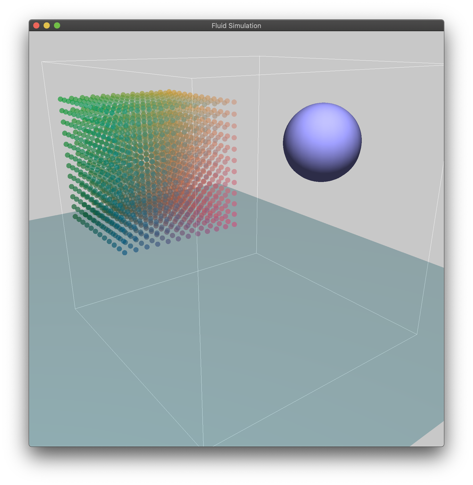
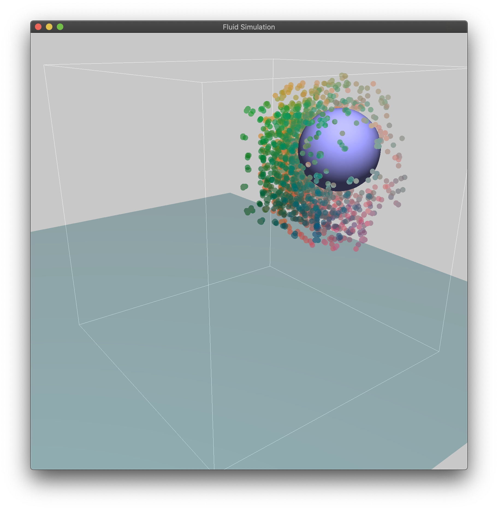
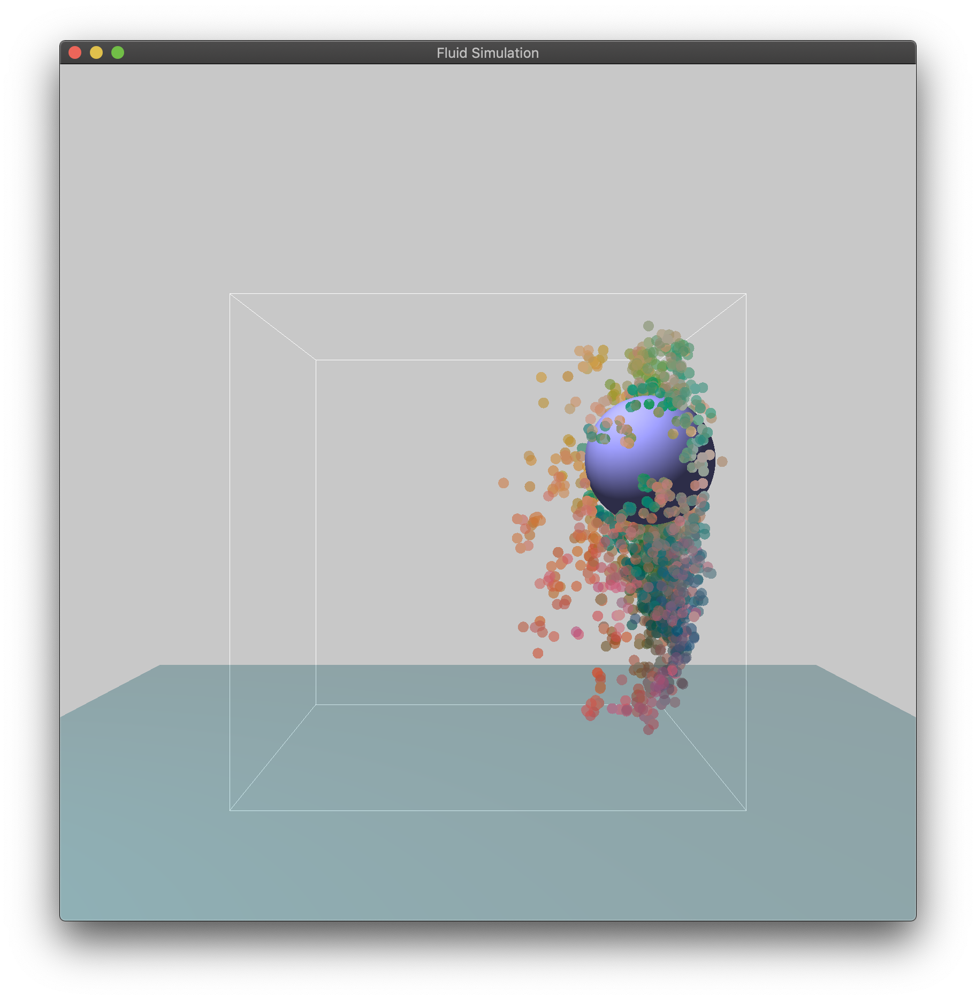

# SPH Fluid Simulation

  

### UI

- ##### Window

    - `ESC` Exit

- ##### Camera

    - `↑` `↓` `←` `→` Rotate camera
    - `W` `S` `A` `D` Move camera position
    - `Q` `E` Move camera closer / farther

- ##### Pause

    - `R` Run
    - `T` Pause

### Environment

- ##### Xcode 11.1

- ##### OpenGL 3.3

    - glad
    - glfw
    - glew
    - glTools

- ##### Other

    - glm

### Data Structures

- ##### Vector.h

    - `struct Vec2`
    - `struct Vec3`

- ##### Point.h

    - `struct Vertex`
        - A simple type of points with only position and normal data
        - Used in rigid body (without texture or anything else)
    - `struct Particle`
        - Point with physical properties.
        - Fluid consists of particles.
        - Execute boundary and collision detection actively.

- ##### Rigid.h

    - `struct Ground`
    - `struct Sphere`
    - `struct Ball`
        - Ball struct include a center data and a sphere.

- ##### Fluid.h

    - `struct Boundary`
        - The container of fluid.
    - `class Fluid`
        - Applied SPH algorithm.

- ##### Program.h -> Shader program built itself from .glsl files

    - `class Program`
        - Compile and connect shaders then make rendering program.

- ##### Display.h -> Global camera, light & Renderers for cloth and rigid bodies

    All those render classes accept only the pointer of the thing it renders. Call their `flush()` function in the main render loop.

    - `struct Camera`
    - `struct Light`
    - `class BoundaryRender`
    - `class FluidRender`
    - `class RigidRender`
    - `class GroundRender`
    - `class BallRender`